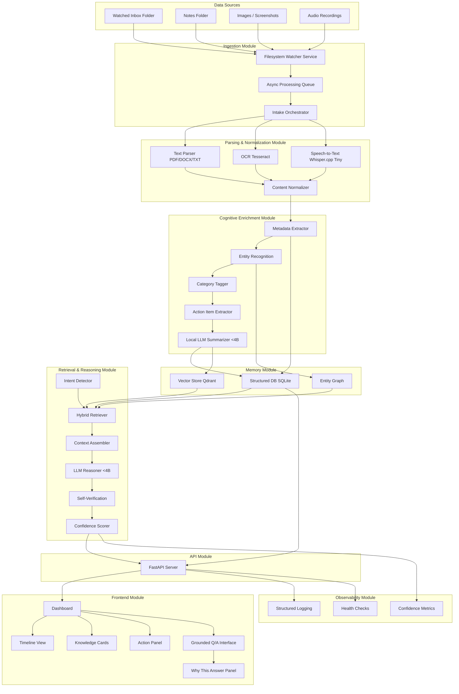

# Synapsis (formerly MemoryGraph) — System Architecture (FINAL)

> **Version**: 2.0 — Final merged design  
> **Date**: 2026-02-14  
> **Status**: LOCKED — Implement from this document

---

## 1. Philosophy

### 1.1 Core Thesis

| What everyone else builds | What we build |
|---|---|
| Embed → Top-K → Generate | Embed → Graph Build → Reason → Verify → Respond |
| Flat vector store | Knowledge graph + vector index |
| Answers when asked | Surfaces insights proactively |
| Stateless per query | Tracks belief evolution over time |
| "Here's your answer" | "Here's my reasoning, sources, and confidence" |

**Why graph > flat vectors**: When you flatten structured data into a flat vector, you lose structure and the results degrade. Your notes, meetings, people, and projects form a graph — entities connected by relationships. Vector search finds *similar text*. Graph traversal finds *related knowledge*. Both together win.

### 1.2 Local-First Is a Feature

- **Privacy**: Zero data leaves the device. No cloud. No leaks.
- **Cost**: No API bills. Run forever after setup.
- **Sovereignty**: User owns their data AND their AI.
- **Efficiency**: Small model + agentic architecture > big model + single call.

### 1.3 Agentic Architecture

Not a single model call — an orchestrated pipeline of specialized agents:

| Agent | Role |
|---|---|
| **Ingestion Agent** | Parse, chunk, extract entities, build graph |
| **Query Planner** | Classify query type, pick retrieval strategy |
| **Retrieval Agent** | Hybrid dense + sparse + graph search |
| **Reasoning Agent** | Synthesize answer from context with citations |
| **Critic Agent** | Verify answer against sources — APPROVE/REVISE/REJECT |
| **Proactive Agent** | Generate digests, detect patterns and contradictions |

---

## 2. High-Level Architecture

### 2.0 Module Flow (Mermaid)



```
┌──────────────────────────────────────────────────────────────────┐
│                        FRONTEND (Next.js)                        │
│  ┌──────────┐  ┌──────────────┐  ┌────────────┐  ┌───────────┐  │
│  │ Chat View │  │ Graph Explorer│  │ Timeline   │  │ Digest    │  │
│  │ Q&A +     │  │ Interactive   │  │ Belief     │  │ Proactive │  │
│  │ citations │  │ knowledge map │  │ evolution  │  │ insights  │  │
│  └──────────┘  └──────────────┘  └────────────┘  └───────────┘  │
└────────────────────────┬─────────────────────────────────────────┘
                         │ REST + WebSocket
┌────────────────────────▼─────────────────────────────────────────┐
│                     BACKEND (FastAPI)                             │
│                                                                   │
│  ┌─────────────────┐  ┌──────────────────┐  ┌────────────────┐  │
│  │ Ingestion Engine │  │ Reasoning Engine  │  │ Proactive      │  │
│  │ • File watcher   │  │ • Query planner   │  │ Engine         │  │
│  │ • Parser router  │  │ • Dense retrieval │  │ • Digest gen   │  │
│  │ • Chunking       │  │ • Sparse retrieval│  │ • Pattern det  │  │
│  │ • Entity extract │  │ • Graph traversal │  │ • Contradiction│  │
│  │ • Graph builder  │  │ • Fusion + rerank │  │   detection    │  │
│  │ • Enrichment     │  │ • LLM reasoning   │  │ • Connection   │  │
│  │                  │  │ • Critic verify   │  │   discovery    │  │
│  └────────┬─────────┘  └────────┬─────────┘  └───────┬────────┘  │
└───────────┼─────────────────────┼─────────────────────┼───────────┘
    ┌───────▼─────────────────────▼─────────────────────▼───────┐
    │                    STORAGE LAYER                           │
    │  ┌─────────────┐  ┌──────────────┐  ┌──────────────────┐  │
    │  │ Qdrant       │  │ SQLite        │  │ File System      │  │
    │  │ vectors +    │  │ graph nodes,  │  │ raw files,       │  │
    │  │ semantic     │  │ edges, beliefs│  │ originals        │  │
    │  │ search       │  │ metadata,     │  │                  │  │
    │  │              │  │ audit log     │  │                  │  │
    │  └─────────────┘  └──────────────┘  └──────────────────┘  │
    └────────────────────────────────────────────────────────────┘
    ┌────────────────────────────────────────────────────────────┐
    │                    MODEL LAYER (all local)                  │
    │  ┌──────────────┐  ┌────────────┐  ┌──────────────────┐   │
    │  │ LLM (Ollama) │  │ Embedder   │  │ Multimodal       │   │
    │  │ Phi-4-mini   │  │ MiniLM-L6  │  │ • faster-whisper │   │
    │  │ 3.8B local   │  │ 384-dim    │  │ • pytesseract    │   │
    │  └──────────────┘  └────────────┘  │ • PyMuPDF        │   │
    │                                     └──────────────────┘   │
    └────────────────────────────────────────────────────────────┘
```

---

## 3. Ingestion Engine

### 3.1 Pipeline

```
File arrives (watcher / quick-add API)
    │
    ▼
Parser Router (by file extension)
    │
    ├─ .pdf → PyMuPDF → text + page info
    ├─ .txt/.md → read → raw text
    ├─ .jpg/.png → pytesseract OCR → extracted text
    ├─ .wav/.mp3 → faster-whisper → transcription
    └─ .json → parse → flatten
    │
    ▼
Chunking (500 chars, 100 overlap, sentence-boundary aware)
    │
    ▼
Parallel:
    ├─ Embed chunks → Qdrant (vector indexing)
    ├─ Entity extraction (regex + spaCy + LLM) → SQLite nodes
    ├─ Relationship extraction (LLM) → SQLite edges
    └─ Enrichment: summary, category, action items (LLM)
    │
    ▼
Post-ingestion hook:
    ├─ Contradiction check (new beliefs vs existing)
    └─ Connection discovery (new entities linking to existing clusters)
```

### 3.2 Supported Modalities (5 total)

| Modality | Tool | Notes |
|---|---|---|
| Text/Markdown | Built-in | Primary format |
| PDF | PyMuPDF (fitz) | Fast, reliable text extraction |
| Images (with text) | pytesseract | OCR for whiteboard photos, screenshots |
| Audio | faster-whisper (tiny, 39M) | Short memos, voice notes |
| JSON | Built-in | Structured notes import |

### 3.3 Entity Extraction Strategy

Three-layer approach (deterministic first, LLM only for what requires understanding):

1. **Regex patterns** (fast, 100% reliable): emails, URLs, dates, phone numbers, money amounts
2. **spaCy NER** (fast, ~85% reliable): person names, organizations, locations
3. **LLM extraction** (slow, ~70% reliable): concepts, projects, decisions, relationships between entities

This layered approach means if the LLM fails or is slow, we still get basic entities. The LLM only handles the hard part: understanding *relationships* between entities and extracting *concepts*.

### 3.4 Ingestion Queue

- Async queue with retry (max 3 attempts, exponential backoff)
- Dead-letter log for failed items (don't block pipeline)
- Idempotent: re-ingesting same file (by checksum) updates, doesn't duplicate

---

## 4. Reasoning Engine

### 4.1 Query Pipeline

```
User Question
    │
    ▼
Query Planner (LLM classifies):
    ├─ SIMPLE: "What is X?" → dense vector search
    ├─ MULTI-HOP: "Ideas from Y about X" → graph traversal + vector
    ├─ TEMPORAL: "How did my view on X change?" → belief timeline query
    └─ CONTRADICTION: "Did I say conflicting things?" → belief diff
    │
    ▼
Hybrid Retrieval:
    ├─ Dense: Qdrant cosine similarity (top-K)
    ├─ Sparse: BM25 keyword matching (top-K)
    ├─ Graph: SQLite/NetworkX path traversal (for multi-hop)
    └─ Fusion: merge + deduplicate + rerank by (relevance × recency)
    │
    ▼
Reasoning (LLM):
    ├─ Synthesize answer from retrieved context
    ├─ Inline source citations: [Source 1], [Source 2]
    ├─ Confidence score (source count × agreement × recency)
    └─ Flag contradictions if sources disagree
    │
    ▼
Verification (Critic Agent):
    ├─ APPROVE: answer supported by sources → return
    ├─ REVISE: partially supported → one retry with feedback
    └─ REJECT: fabricated → return "I don't have enough info" + show what was found
    │
    ▼
Response: answer + citations + confidence + verification + reasoning chain
```

### 4.2 Hybrid Retrieval (Dense + Sparse + Graph)

This is an upgrade over pure vector search. Three retrieval paths, fused:

| Path | Method | Catches |
|---|---|---|
| **Dense** | Qdrant cosine similarity | Semantically similar content |
| **Sparse** | BM25 (rank-bm25) | Exact keyword matches vectors miss |
| **Graph** | NetworkX path traversal | Relationships vectors can't represent |

**Fusion**: Reciprocal Rank Fusion (RRF) to merge results from all three paths, then rerank by combined score weighted by recency.

### 4.3 Confidence Scoring

```
confidence = 0.3 × top_source_score + 0.3 × source_agreement + 0.2 × source_count_factor + 0.2 × recency_factor

where:
  top_source_score: best retrieval score (0-1)
  source_agreement: do sources agree? (0=conflict, 1=unanimous)
  source_count_factor: min(retrieved_count / 3, 1.0)
  recency_factor: decay by age of sources

mapped to:
  >= 0.7 → "high"
  >= 0.4 → "medium"
  >= 0.2 → "low"
  < 0.2  → "none" → trigger abstention
```

### 4.4 Abstention Behavior

When confidence is "none" or critic returns REJECT:

> "I don't have enough information in your records to answer this confidently. Here's what I found that might be related: [show partial results with low-confidence warning]"

This is a **designed feature**, not an error state. The rubric gives 0 points for "confident incorrect answers."

---

## 5. Proactive Engine

**Purpose**: Make the system more than a chatbot. Generate insights without being asked.

### 5.1 Features (Priority Order)

**P0: Connection Discovery** (post-ingestion hook)
- After every ingestion, check if new entities link to existing graph clusters
- "Your new note about 'design patterns' connects to 3 earlier notes about 'code architecture'"
- Implementation: entity overlap detection + LLM summary of connection

**P1: Digest Generation** (scheduled, every N hours or on-demand)
- Count topic mentions across recent ingestions
- Group by category and frequency
- "You mentioned 'deadline' 6 times this week across 4 documents"
- Implementation: SQL aggregation + LLM narrative summary

**P2: Contradiction Detection** (post-ingestion hook)
- Compare new beliefs against existing beliefs for same entity
- "You said 'Option A is best' on Jan 10, but 'Option B is best' on Feb 1"
- Implementation: belief table diff + LLM classification

**P3: Pattern Alerts** (scheduled)
- Identify frequently co-occurring entities
- "These 3 projects share 5 common people"
- Implementation: graph centrality analysis (NetworkX)

### 5.2 Triggering

- **Post-ingestion**: Connection discovery + contradiction detection (fast, runs after each file)
- **Scheduled**: Digests + pattern alerts (APScheduler, every 6 hours or on app startup)

---

## 6. Knowledge Graph Schema (SQLite)

```sql
-- Documents: raw ingested items
CREATE TABLE documents (
    id          TEXT PRIMARY KEY,
    filename    TEXT NOT NULL,
    modality    TEXT NOT NULL,  -- text, pdf, image, audio, json
    source_type TEXT NOT NULL,  -- watcher, quick_add, audio_drop
    source_uri  TEXT,
    checksum    TEXT UNIQUE,    -- for idempotent re-ingestion
    ingested_at TEXT NOT NULL,
    status      TEXT DEFAULT 'processed'  -- queued, processed, failed
);

-- Chunks: segments of documents
CREATE TABLE chunks (
    id          TEXT PRIMARY KEY,
    document_id TEXT NOT NULL REFERENCES documents(id),
    content     TEXT NOT NULL,
    chunk_index INTEGER NOT NULL,
    total_chunks INTEGER NOT NULL,
    page_number INTEGER,
    summary     TEXT,
    category    TEXT,
    action_items TEXT,  -- JSON array
    qdrant_id   TEXT    -- reference to vector in Qdrant
);

-- Entities: nodes in the knowledge graph
CREATE TABLE nodes (
    id            TEXT PRIMARY KEY,
    type          TEXT NOT NULL,  -- person, project, concept, event, location, task
    name          TEXT NOT NULL,
    properties    TEXT,           -- JSON blob
    first_seen    TEXT NOT NULL,
    last_seen     TEXT NOT NULL,
    mention_count INTEGER DEFAULT 1,
    source_chunks TEXT            -- JSON array of chunk IDs
);

-- Relationships: edges in the knowledge graph
CREATE TABLE edges (
    id           TEXT PRIMARY KEY,
    source_id    TEXT NOT NULL REFERENCES nodes(id),
    target_id    TEXT NOT NULL REFERENCES nodes(id),
    relationship TEXT NOT NULL,  -- mentions, works_on, decided, relates_to
    properties   TEXT,           -- JSON blob
    created_at   TEXT NOT NULL,
    source_chunk TEXT            -- chunk where relationship was extracted
);

-- Beliefs: temporal tracking of evolving knowledge
CREATE TABLE beliefs (
    id            TEXT PRIMARY KEY,
    node_id       TEXT NOT NULL REFERENCES nodes(id),
    belief        TEXT NOT NULL,  -- "Option A is best for the logo"
    confidence    REAL,
    source_chunk  TEXT,
    timestamp     TEXT NOT NULL,
    superseded_by TEXT REFERENCES beliefs(id)  -- NULL if current
);

-- Audit: query/answer traceability
CREATE TABLE audit_log (
    id         TEXT PRIMARY KEY,
    event_type TEXT NOT NULL,  -- query, answer, ingestion, error
    payload    TEXT,           -- JSON blob
    timestamp  TEXT NOT NULL
);

CREATE INDEX idx_edges_source ON edges(source_id);
CREATE INDEX idx_edges_target ON edges(target_id);
CREATE INDEX idx_nodes_type ON nodes(type);
CREATE INDEX idx_nodes_name ON nodes(name);
CREATE INDEX idx_beliefs_node ON beliefs(node_id);
CREATE INDEX idx_chunks_doc ON chunks(document_id);
CREATE INDEX idx_docs_checksum ON documents(checksum);
```

**Why this wins points**:
- `documents` + `chunks` = full traceability from answer → chunk → original file
- `beliefs` with `superseded_by` = temporal chain → timeline visualization
- `mention_count` = "you mentioned X 8 times" (proactive digest)
- `edges` = multi-hop traversal paths
- `audit_log` = query/answer traceability for demo

---

## 7. Data Contracts

### 7.1 Internal Types (Python dataclasses)

```python
@dataclass
class IngestionRecord:
    ingestion_id: str
    source_type: str     # "watcher" | "quick_add" | "audio_drop"
    modality: str        # "text" | "pdf" | "image" | "audio" | "json"
    source_uri: str
    collected_at: str
    checksum: str
    status: str          # "queued" | "processed" | "failed"

@dataclass
class MemoryCard:
    memory_id: str
    title: str
    summary: str
    category: str
    entities: list[str]
    action_items: list[str]
    modality: str
    event_time: str
    ingestion_time: str

@dataclass
class ChunkEvidence:
    chunk_id: str
    file_name: str
    snippet: str
    score_dense: float
    score_sparse: float
    score_final: float

@dataclass
class AnswerPacket:
    answer: str
    confidence: str       # "high" | "medium" | "low" | "none"
    confidence_score: float
    uncertainty_reason: str | None
    sources: list[ChunkEvidence]
    verification: str     # "APPROVE" | "REVISE" | "REJECT"
    reasoning_chain: str | None
```

### 7.2 API Surface

| Method | Path | Description |
|---|---|---|
| POST | `/ingest/file` | Upload a file → queue for processing |
| POST | `/ingest/quick-add` | Submit raw text directly |
| POST | `/query/ask` | Ask a question → full reasoning pipeline |
| GET | `/memory/timeline` | Chronological feed of ingested memories |
| GET | `/memory/{id}` | Single memory card with full detail |
| GET | `/memory/graph` | Graph data for visualization (nodes + edges) |
| GET | `/memory/stats` | Counts, categories, entity summary |
| GET | `/insights/digest` | Latest proactive digest |
| GET | `/health` | Service status |
| WS | `/query/stream` | Streaming answer tokens |

### 7.3 Contract Rules

- Every `AnswerPacket` MUST include `sources[]` (even if empty)
- `confidence` and `verification` are MANDATORY fields
- Empty evidence → force abstention (confidence = "none")
- All responses include `reasoning_chain` for transparency

---

## 8. Technology Stack (Final)

| Component | Choice | Rationale |
|---|---|---|
| **Primary LLM** | Phi-4-mini-instruct (3.8B) | Stronger reasoning at this size, native function calling, MIT license |
| **Fallback LLM** | Qwen2.5-3B-Instruct | If Phi-4 is too slow on demo hardware |
| **LLM Runtime** | Ollama | Handles quantization (GGUF), simple API |
| **Embeddings** | all-MiniLM-L6-v2 (384-dim) | 80MB, fast, well-tested, local |
| **Sparse Search** | rank-bm25 | BM25 keyword matching, complements vectors |
| **Vector DB** | Qdrant | On-disk persistence, filtering, production-ready |
| **Graph Store** | SQLite + JSON columns | Zero-config, ships with Python |
| **Graph Analysis** | NetworkX | In-memory subgraph loading, path-finding algorithms |
| **PDF** | PyMuPDF (fitz) | Fastest Python PDF extractor |
| **Audio** | faster-whisper (tiny, 39M) | Local, fast on CPU |
| **OCR** | pytesseract | Mature, handles whiteboard photos |
| **NER** | spaCy (en_core_web_sm) | Fast named entity recognition |
| **File Watching** | watchdog | Cross-platform filesystem monitoring |
| **Backend** | FastAPI | Async, WebSocket, SSE support |
| **Frontend** | Next.js + shadcn/ui | Clean components, good ecosystem |
| **Graph Viz** | react-force-graph | Interactive 2D/3D, React-native, demo wow factor |
| **Scheduler** | APScheduler | Background tasks for proactive engine |
| **Deployment** | Docker Compose | Reproducible, one-command startup |
| **Logging** | structlog | Structured JSON logs for debugging |

---

## 9. Performance Targets

| Metric | Target | Notes |
|---|---|---|
| Ingestion to indexed | ≤ 30s per file | Including embedding + entity extraction |
| First answer token | ≤ 2s | Streaming starts quickly |
| Full answer | ≤ 8s | Including retrieval + reasoning + verification |
| Retrieval (dense + sparse) | ≤ 1.5s | Pre-embedded queries |
| Graph traversal | ≤ 500ms | NetworkX on <1K nodes |
| UI render | ≤ 200ms | Client-side, no SSR needed for interactivity |

---

## 10. Deployment (Docker Compose)

```yaml
# docker-compose.yml (conceptual)
services:
  ollama:
    image: ollama/ollama
    volumes:
      - ollama_data:/root/.ollama
    # Pre-pull: phi3.5-mini-instruct

  qdrant:
    image: qdrant/qdrant
    volumes:
      - qdrant_data:/qdrant/storage
    ports:
      - "6333:6333"

  backend:
    build: ./backend
    depends_on: [ollama, qdrant]
    volumes:
      - ./inbox:/app/inbox      # watched folder
      - ./data:/app/data        # SQLite + raw files
    ports:
      - "8000:8000"

  frontend:
    build: ./frontend
    depends_on: [backend]
    ports:
      - "3000:3000"

volumes:
  ollama_data:
  qdrant_data:
```

**One-command startup**: `docker compose up` → everything runs.

---

## 11. Build Schedule (24h, 5 People)

| Block | Person A (Backend Lead) | Person B (Data Layer) | Person C (Reasoning) | Person D (Frontend) | Person E (UX + Demo) |
|---|---|---|---|---|---|
| H0-H2 | Docker Compose + Ollama setup | SQLite schema + migrations | Prompt templates | Next.js shell + routing | shadcn/ui design system |
| H2-H4 | File watcher + ingestion queue | Qdrant + embedding pipeline | Retriever scaffold (dense) | Chat view skeleton | Graph Explorer skeleton |
| H4-H6 | Parser router (PDF, text, image) | Chunking + entity extraction | Sparse retrieval (BM25) + fusion | Source citation panel | Timeline view |
| H6-H8 | Audio ingestion (faster-whisper) | Graph builder (nodes + edges) | Reasoning agent + critic | Streaming WebSocket | Confidence badges |
| H8-H10 | Quick-add endpoint | Belief tracking + contradictions | Query planner | Why-this-answer panel | Integration pass |
| H10-H12 | Bug fixes + error handling | Bug fixes + persistence tests | Bug fixes + retrieval tuning | Bug fixes | Bug fixes |
| H12-H14 | Proactive engine (connection discovery) | Proactive engine (digest SQL) | Multi-hop graph queries | Digest view | Graph viz polish |
| H14-H16 | API hardening + logging | Demo dataset loading | Demo query testing | Responsive + polish | End-to-end flow test |
| H16-H18 | Demo scripting | Demo data verification | Hard question prep | Visual polish final | Pitch slides |
| H18-H20 | Full rehearsal | Full rehearsal | Full rehearsal | Full rehearsal | Full rehearsal |
| H20-H24 | Freeze + hotfixes only | Freeze + hotfixes only | Freeze + hotfixes only | Freeze + hotfixes only | Pitch lead + backup video |

**Critical path**: Ingestion → Storage → Retrieval → Reasoning → UI evidence display

**Hard freeze at H20.** No new features after that. Only bug fixes.

---

## 12. Acceptance Criteria

| ID | Requirement | Test | Pass Condition |
|---|---|---|---|
| AC-01 | Auto-ingest multimodal | Drop 1 file per modality in watched folder | All appear in timeline within 30s |
| AC-02 | Understand content by format | Query "summarize the last PDF" | Answer references correct content |
| AC-03 | Organize into categories | Filter by category in UI | Categories assigned automatically |
| AC-04 | Summaries + action items | Ingest long note | Summary card + action list generated |
| AC-05 | Grounded Q&A | Ask factual question | Answer includes `sources[]` with openable evidence |
| AC-06 | Handle uncertainty | Ask out-of-knowledge question | System explicitly says "I don't have enough info" |
| AC-07 | Continuous operation | Ingest while querying in same session | Both work simultaneously |
| AC-08 | Persistent memory | Restart all services, re-query | Same answers as before restart |
| AC-09 | Semantic retrieval | Query with synonyms (not exact keywords) | Relevant results returned |
| AC-10 | Self-verification | Ask question where sources conflict | System flags contradiction |
| AC-11 | Modern UI | Demo covers chat + graph + timeline | All three views functional |
| AC-12 | Model compliance | Check Ollama model manifest | Phi-4-mini < 4B, no external APIs in logs |

---

## 13. Scoring Map

| Component | Targets | Points |
|---|---|---|
| Ingestion Engine + File Watcher + 5 modalities | Multimodal Ingestion | 10% |
| SQLite graph + Qdrant + beliefs table + restart-safe | Persistent Memory | 10% |
| Hybrid retrieval + graph traversal + critic + confidence | Reasoning & Verification | 15% |
| Proactive digest + contradictions + connections + graph viz | Innovation | 15% |
| Chat + Graph Explorer + Timeline + citations + clean UX | Usability | 10% |
| Ollama + Phi-4-mini + documented + auditable | Model Compliance | 5% |
| Stable demo + clear pitch + pre-tested queries | Presentation | 15% |

**Every line of code must trace back to one of these 7 rows.**

---

## 14. Anti-Requirements (DO NOT BUILD)

- ❌ Medical/clinical anything (not our domain, regulated trap)
- ❌ IMAP email polling (auth complexity, demo risk)
- ❌ Mobile app
- ❌ Multi-user / auth / SSO
- ❌ Cloud deployment
- ❌ Browser extension
- ❌ Custom model training
- ❌ Sentiment analysis
- ❌ Real-time collaboration
- ❌ 0.5B fallback model (too weak to be useful)

---

## 15. Presentation Talking Points

### "Why local and not cloud?"
> "Privacy by design. In regulated industries, data can't leave the premises. Our system runs entirely on your laptop. No internet, no API bills, no data leaks. That's not a limitation — that's a feature."

### "Why a small model?"
> "The intelligence isn't in the model — it's in the architecture. We use an agentic pipeline: specialized agents for ingestion, reasoning, verification. A 3.8B model doing one focused task well beats a 70B model doing everything mediocrely."

### "How is this different from a chatbot?"
> "A chatbot answers when asked. Our system builds understanding over time. It tracks how your beliefs evolve, detects contradictions, discovers connections you didn't ask about, and shows you the reasoning — not just the answer."

### "Why a knowledge graph?"
> "Same reason molecular biology uses graphs instead of flat vectors — structure matters. Your knowledge has people, projects, decisions, timelines. Flatten it into embeddings and you can find similar text, but you can't traverse relationships."

### "What about trust / reliability?"
> "Every answer includes source citations, confidence scores, and passes through an independent verification agent. If our system isn't confident, it says so. We optimize for being trustworthy, not sounding confident."

---

## 16. Risk Register

| Risk | Impact | Mitigation | Fallback |
|---|---|---|---|
| LLM too slow on demo hardware | HIGH | Test on demo laptop early, use quantized GGUF | Switch to Qwen2.5-3B (smaller, faster) |
| Entity extraction unreliable | HIGH | Three-layer approach (regex + spaCy + LLM) | Degrade to regex + spaCy only |
| Graph viz overwhelming | MEDIUM | Limit demo to ≤50 nodes, clear labels | Static screenshot of graph |
| Audio transcription slow | MEDIUM | Short clips only, pre-transcribe for demo | Text-only demo |
| Frontend not ready | MEDIUM | API works standalone via Swagger | Fall back to Swagger UI |
| Demo query returns bad result | HIGH | Pre-test 5 queries, use those | Never improvise live queries |
| Docker Compose breaks on demo laptop | MEDIUM | Preflight check script | Run services manually |
