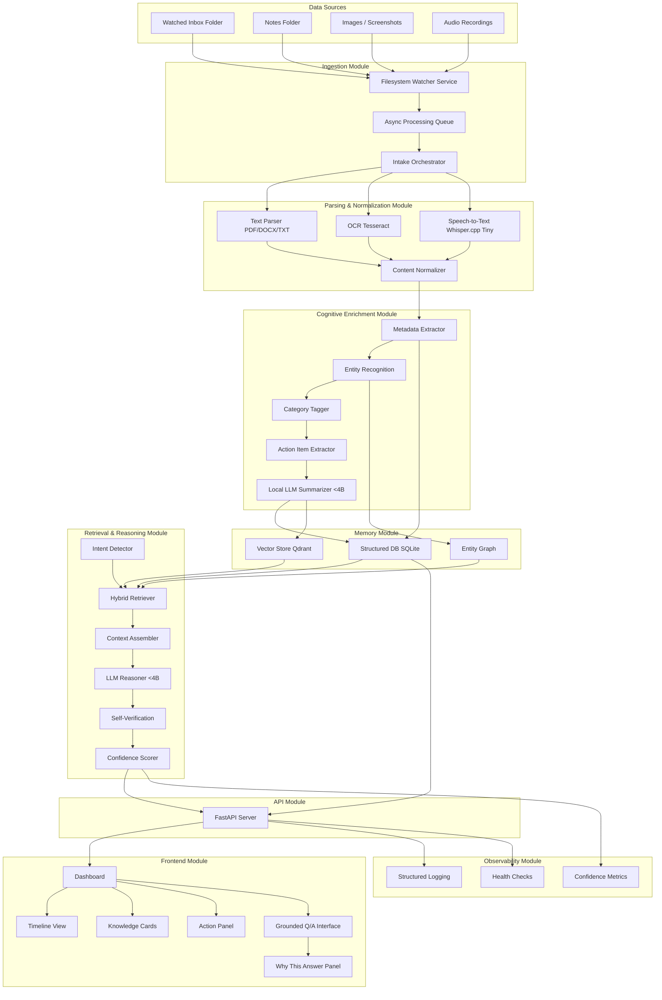

# Synapsis — System Architecture

> **Version**: 3.0  
> **Date**: 2026-02-14  
> **Status**: Active architecture baseline

---

## 1) Product Intent

Synapsis is a local-first personal intelligence system that ingests multimodal personal knowledge, builds structured memory, and returns grounded answers with confidence and traceability.

- **Not** a generic chatbot
- **Not** a regulated medical/legal advisor
- **Yes** to proactive personal knowledge synthesis

---

## 2) Model Strategy (Filtered + Practical)

### Primary and fallback LLMs

| Role | Model | Why |
|---|---|---|
| Primary | **Microsoft Phi-4-mini-instruct (3.8B)** | Stronger reasoning than Phi-3.5 at same class, long context, native function calling |
| Fallback | **Qwen2.5-3B-Instruct** | Faster fallback on weaker demo hardware |
| Rejected baseline | Phi-3.5-mini-instruct | Kept as historical baseline only |

### Why Phi-4-mini-instruct is the upgrade

- Same model class sizing for local deployment practicality
- Better reasoning/benchmark profile than Phi-3.5 class
- Native function calling aligns with agent/tool orchestration
- Keeps local-first, small-model architecture intact

---

## 3) High-Level Architecture (Mermaid)

---

## 4) Core Modules and Responsibilities

- **Ingestion**: watch folders, queue jobs, route parsers
- **Parsing/Normalization**: text extraction across PDF, OCR, audio, plain text
- **Cognitive Enrichment**: metadata, entities, categories, action items, summaries
- **Memory**: SQLite (structure), Qdrant (semantics), graph relationships
- **Retrieval/Reasoning**: intent-aware hybrid retrieval + answer verification
- **API/UI**: FastAPI backend and dashboard with timeline, chat, and Knowledge Cards
- **Observability**: health endpoints, structured logs, confidence and quality telemetry

---

## 5) Non-Negotiables

- Fully local-first operation
- Open-source models and tooling only
- LLM class stays under 4B params
- Grounded responses with source traceability and confidence scoring

---

## 6) Architecture Notes for Build

- Keep retrieval **hybrid** (dense + sparse + graph), not vector-only
- Keep **abstention behavior** explicit when confidence is low
- Keep **observability first-class** to debug ingestion and reasoning quality
- Keep **Knowledge Cards** as primary UX unit for memory outputs
