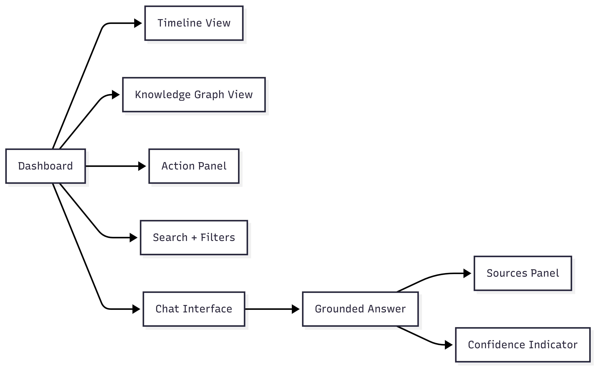
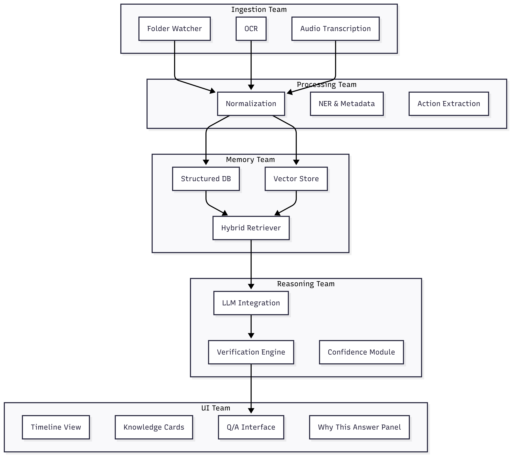

<div align="center">

# 🧠 Synapsis — AI Cognitive Assistant

**Your personal, fully local AI memory that never forgets.**

[](https://python.org)
[](https://fastapi.tiangolo.com)
[](https://nextjs.org)
[](https://docker.com)
[](https://ollama.com)
[](https://sqlite.org)
[](https://tailwindcss.com)
[](https://typescriptlang.org)

> **Team**: AI MINDS  
> **Constraint**: Fully local, open-source LLM < 4B params — zero proprietary APIs

</div>

---

## 🔍 The Problem

We constantly capture information across **images, text, audio, documents, and web pages**. Over time, this creates a massive personal information space that's nearly impossible to organize or search. Important knowledge is lost — not because it's unavailable, but because it **can't be retrieved when needed**.

## 💡 Our Solution

**Synapsis** is a zero-touch cognitive assistant that **automatically ingests** your personal data across multiple modalities, understands its meaning, and builds a **persistent, structured memory** you can query with natural language.

> 🚀 No uploads. No tagging. No manual work. Just use your computer — Synapsis learns in the background.

---

## 🏗️ Architecture



## ✨ Key Features

| Feature | Description |
|---|---|
| 📂 **Automatic Multimodal Ingestion** | Watches your directories for text, PDFs, images (OCR), audio, and documents — zero manual uploads |
| 🧩 **Semantic Understanding** | Interprets content meaning and purpose regardless of format |
| 🧠 **Persistent Memory** | Structured knowledge graph (vector + graph DB) that survives restarts and grows over time |
| 💬 **Natural Language Q&A** | Ask questions and get grounded answers with full source citations |
| ✅ **Self-Verification** | Reasons about relevance and verifies its own answers before presenting them |
| 🔗 **Proactive Insights** | Automatically surfaces connections, contradictions, and actionable items across your data |
| 🔒 **Fully Air-Gapped** | Zero internet required — everything runs locally on your machine |

---

## 🔄 Data Flow



---

## 🛠️ Tech Stack

| Layer | Technology | Purpose |
|---|---|---|
| 🤖 **LLM** | -000?style=flat-square&logo=ollama) | Local language model for reasoning & generation |
| 📐 **Embeddings** |  | Semantic embeddings (384-dim, fully local) |
| 🗄️ **Vector DB** |  | Vector similarity search (on-disk persistence) |
| 🕸️ **Graph Store** |  | Entity & relationship graph persistence |
| ⚡ **Backend** |  | REST API, ingestion pipeline, reasoning engine |
| 🎨 **Frontend** |   | Chat UI, 3D knowledge graph, timeline views |
| 📦 **Deployment** |  | One-command local deployment |

---

## ✅ Compliance

| Rule | Status |
|---|---|
| No proprietary APIs | ✅ Zero external API calls |
| LLM < 4B parameters | ✅ Phi-4-mini = 3.8B |
| Fully local & air-gapped | ✅ Localhost only (127.0.0.1) |
| Continuous operation | ✅ Background file watcher + persistent store |
| Persistent memory | ✅ Qdrant + SQLite, survives restarts |
| Open-source model | ✅ MIT licensed |

---

## 🚀 Quick Start

```bash
# 1. Clone the repo
git clone https://github.com/Lacoste-INSAT/AI_Minds.git
cd AI_Minds

# 2. Start everything with Docker
docker-compose up --build

# 3. Open the UI
# → http://localhost:3000
```

---

## 👥 Team — AI MINDS

| Member | GitHub |
|---|---|
| **Akram Zaabi** | [@AkramZaabi](https://github.com/AkramZaabi) |
| **Makki Aloulou** | [@MakkiAloulou](https://github.com/MakkiAloulou) |
| **Rami Troudi** | [@Rami-Troudi](https://github.com/Rami-Troudi) |
| **Yassine Kolsi** | [@yassinekolsi](https://github.com/yassinekolsi) |
| **Youssef Rekik** | [@youssefrekik1](https://github.com/youssefrekik1) |

---

<div align="center">

*Built with ❤️ during MSB AI Hackathon*

</div>
