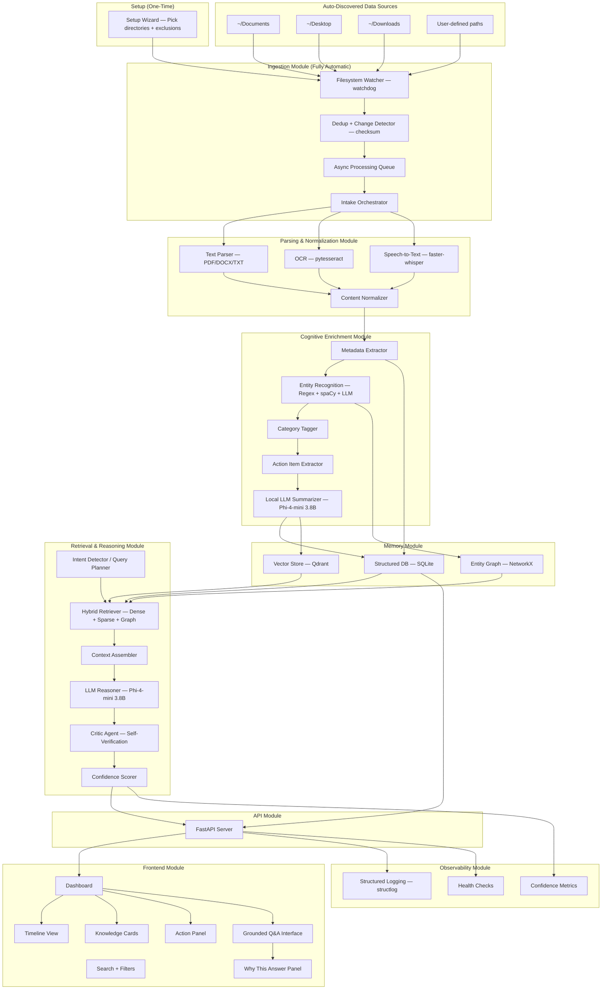

# Synapsis — System Architecture (FINAL)

> **Version**: 4.1 — Fact-checked models + 3-tier fallback + accessibility  
> **Date**: 2026-02-14  
> **Status**: LOCKED — Implement from this document  
> **Change**: 3-tier model strategy (phi4-mini → qwen2.5:3b → qwen2.5:0.5b), fact-checked all model specs via HuggingFace/Ollama, accessibility baseline, Search+Filters view, compliance gate

---

## 1. Philosophy

### 1.1 Core Thesis

| What everyone else builds | What we build |
|---|---|
| User uploads files manually | **Zero-touch** — system auto-discovers and ingests everything |
| Embed → Top-K → Generate | Embed → Graph Build → Reason → Verify → Respond |
| Flat vector store | Knowledge graph + vector index |
| Answers when asked | Surfaces insights proactively |
| Stateless per query | Tracks belief evolution over time |
| "Here's your answer" | "Here's my reasoning, sources, and confidence" |
| Cloud-connected | **Air-gapped** — zero internet, zero data leaks, ever |

**Why graph > flat vectors**: When you flatten structured data into a flat vector, you lose structure and the results degrade. Your notes, meetings, people, and projects form a graph — entities connected by relationships. Vector search finds *similar text*. Graph traversal finds *related knowledge*. Both together win.

### 1.2 Air-Gapped Local — Not "Local-First", LOCAL-ONLY

> **Mentor directive**: "Purely local, zero internet connection, all running locally for security reasons."

- **Air-gapped**: Zero network calls. No DNS, no HTTP out, no telemetry. Period.
- **Privacy**: Data never leaves the device. Not encrypted-in-transit — *never transmitted at all*.
- **Cost**: No API bills. Run forever after setup.
- **Sovereignty**: User owns their data AND their AI.
- **Efficiency**: Small model + agentic architecture > big model + single call.
- **Offline-ready**: All models, embeddings, and dependencies pre-bundled. Works on airplane mode.

### 1.3 Zero-Touch Ingestion — The User Does NOTHING

> **Mentor directive**: "Absolutely zero manual ingestion. The user is not even in the data pipeline."

The user never uploads, drags, drops, or clicks "import". The system:
1. **On first launch**: Presents a setup wizard — user picks which directories to watch (Documents, Desktop, Downloads, etc.) and optionally sets exclusion rules (file types, folder patterns)
2. **After setup**: Continuously and silently watches those directories. New files, modified files, deleted files — all handled automatically.
3. **User's only role**: Ask questions and receive insights. That's it.

This is the **#1 differentiator** from every other RAG project at this hackathon. Everyone else has an upload button. We don't.

### 1.4 Localhost Web Interface

> **Mentor directive**: "Needs to run for all users. Localhost interface rather than a Windows software."

- Served at `http://localhost:3000` — works in any browser, any OS
- No Electron, no Tauri, no native app — just a web server bound to `127.0.0.1`
- Accessible to anyone who can open a browser — maximum compatibility
- No external network binding — `127.0.0.1` only, never `0.0.0.0`

### 1.5 Agentic Architecture

Not a single model call — an orchestrated pipeline of specialized agents:

| Agent | Role |
|---|---|
| **Ingestion Agent** | Parse, chunk, extract entities, build graph |
| **Query Planner** | Classify query type, pick retrieval strategy |
| **Retrieval Agent** | Hybrid dense + sparse + graph search |
| **Reasoning Agent** | Synthesize answer from context with citations |
| **Critic Agent** | Verify answer against sources — APPROVE/REVISE/REJECT |
| **Proactive Agent** | Generate digests, detect patterns and contradictions |

---

## 2. System Overview (Mermaid)



---

## 3. High-Level Architecture

```
┌──────────────────────────────────────────────────────────────────┐
│               FRONTEND (Next.js @ localhost:3000)                  │
│  ┌──────────┐  ┌──────────────┐  ┌────────────┐  ┌───────────┐  │
│  │ Chat View │  │ Graph Explorer│  │ Timeline   │  │ Digest    │  │
│  │ Q&A +     │  │ Interactive   │  │ Belief     │  │ Proactive │  │
│  │ citations │  │ knowledge map │  │ evolution  │  │ insights  │  │
│  └──────────┘  └──────────────┘  └────────────┘  └───────────┘  │
│  ┌─────────────────────┐  ┌──────────────────────────────────┐   │
│  │ Search + Filters     │  │ Knowledge Cards + Action Panel  │   │
│  │ full-text + category │  │ summaries, actions, categories  │   │
│  └─────────────────────┘  └──────────────────────────────────┘   │
│  ┌──────────────────────────────────────────────────────────────┐ │
│  │ Setup Wizard (first-run only): pick directories + exclusions │ │
│  └──────────────────────────────────────────────────────────────┘ │
└────────────────────────┬─────────────────────────────────────────┘
                         │ REST + WebSocket (localhost only)
┌────────────────────────▼─────────────────────────────────────────┐
│                BACKEND (FastAPI @ localhost:8000)                  │
│                                                                   │
│  ┌─────────────────┐  ┌──────────────────┐  ┌────────────────┐  │
│  │ Ingestion Engine │  │ Reasoning Engine  │  │ Proactive      │  │
│  │ • Auto-watcher   │  │ • Query planner   │  │ Engine         │  │
│  │ • Dir scanner    │  │ • Dense retrieval │  │ • Digest gen   │  │
│  │ • Dedup (cksum)  │  │ • Sparse retrieval│  │ • Pattern det  │  │
│  │ • Parser router  │  │ • Graph traversal │  │ • Contradiction│  │
│  │ • Chunking       │  │ • Fusion + rerank │  │   detection    │  │
│  │ • Entity extract │  │ • LLM reasoning   │  │ • Connection   │  │
│  │ • Graph builder  │  │ • Critic verify   │  │   discovery    │  │
│  └────────┬─────────┘  └────────┬─────────┘  └───────┬────────┘  │
│                                                                   │
│  ┌─────────────────────────────────────────────────────────────┐  │
│  │ Observability: structlog + health checks + confidence metrics│  │
│  └─────────────────────────────────────────────────────────────┘  │
└───────────┼─────────────────────┼─────────────────────┼───────────┘
    ┌───────▼─────────────────────▼─────────────────────▼───────┐
    │                    STORAGE LAYER                           │
    │  ┌─────────────┐  ┌──────────────┐  ┌──────────────────┐  │
    │  │ Qdrant       │  │ SQLite        │  │ File System      │  │
    │  │ vectors +    │  │ graph nodes,  │  │ raw files,       │  │
    │  │ semantic     │  │ edges, beliefs│  │ originals        │  │
    │  │ search       │  │ metadata,     │  │                  │  │
    │  │              │  │ audit log     │  │                  │  │
    │  └─────────────┘  └──────────────┘  └──────────────────┘  │
    └────────────────────────────────────────────────────────────┘
    ┌────────────────────────────────────────────────────────────┐
    │                    MODEL LAYER (all local, 3-tier)           │
    │  ┌──────────────────────────────────────────────────────┐   │
    │  │ LLM (Ollama) — 3-Tier Fallback Chain                │   │
    │  │ T1: phi4-mini    (3.8B, MIT,   2.5GB, 128K ctx)     │   │
    │  │ T2: qwen2.5:3b   (3.1B, Qwen,  1.9GB,  32K ctx)    │   │
    │  │ T3: qwen2.5:0.5b (0.5B, Apache, 398MB, 32K ctx)    │   │
    │  └──────────────────────────────────────────────────────┘   │
    │  ┌────────────┐  ┌──────────────────┐                      │
    │  │ Embedder   │  │ Multimodal       │                      │
    │  │ MiniLM-L6  │  │ • faster-whisper │                      │
    │  │ 384-dim    │  │ • pytesseract    │                      │
    │  │            │  │ • PyMuPDF        │                      │
    │  └────────────┘  └──────────────────┘                      │
    └────────────────────────────────────────────────────────────┘
```

---

## 4. Ingestion Engine

### 4.1 Zero-Touch Pipeline (NO USER INVOLVEMENT)

```
[FIRST RUN] Setup Wizard
    │
    ├─ User picks directories to watch (~/Documents, ~/Desktop, ~/Downloads, custom)
    ├─ User sets exclusion rules (optional): file types, folder patterns, size limits
    └─ Config saved to ~/.synapsis/config.json
    │
    ▼
[CONTINUOUS] Auto-Discovery & Watch
    │
    ├─ Initial scan: crawl all configured directories recursively
    ├─ Ongoing: watchdog monitors for new / modified / deleted files
    ├─ Dedup: checksum-based — skip already-ingested, re-process if modified
    └─ Rate limit: process max N files/minute to avoid CPU spike
    │
    ▼
Parser Router (by file extension — automatic)
    │
    ├─ .pdf → PyMuPDF → text + page info
    ├─ .txt/.md → read → raw text
    ├─ .jpg/.png → pytesseract OCR → extracted text
    ├─ .wav/.mp3 → faster-whisper → transcription
    └─ .json → parse → flatten
    │
    ▼
Content Normalizer (whitespace, encoding, dedup)
    │
    ▼
Chunking (500 chars, 100 overlap, sentence-boundary aware)
    │
    ▼
Parallel:
    ├─ Embed chunks → Qdrant (vector indexing)
    ├─ Entity extraction (regex + spaCy + LLM) → SQLite nodes
    ├─ Relationship extraction (LLM) → SQLite edges
    └─ Enrichment: summary, category, action items (LLM)
    │
    ▼
Post-ingestion hook:
    ├─ Contradiction check (new beliefs vs existing)
    └─ Connection discovery (new entities linking to existing clusters)
```

**The user never sees this pipeline.** They just use their computer normally — save files, take notes, record memos — and Synapsis silently builds their knowledge graph in the background.

### 4.2 Supported Modalities (5 total)

| Modality | Tool | Notes |
|---|---|---|
| Text/Markdown | Built-in | Primary format |
| PDF | PyMuPDF (fitz) | Fast, reliable text extraction |
| Images (with text) | pytesseract | OCR for whiteboard photos, screenshots |
| Audio | faster-whisper (tiny, 39M) | Short memos, voice notes |
| JSON | Built-in | Structured notes import |

### 4.3 Entity Extraction Strategy

Three-layer approach (deterministic first, LLM only for what requires understanding):

1. **Regex patterns** (fast, 100% reliable): emails, URLs, dates, phone numbers, money amounts
2. **spaCy NER** (fast, ~85% reliable): person names, organizations, locations
3. **LLM extraction** (slow, ~70% reliable): concepts, projects, decisions, relationships between entities

This layered approach means if the LLM fails or is slow, we still get basic entities. The LLM only handles the hard part: understanding *relationships* between entities and extracting *concepts*.

### 4.4 Boundary Configuration (Setup Wizard)

The **only** user interaction with the data pipeline. Runs once on first launch, editable later via Settings.

```json
// ~/.synapsis/config.json
{
  "watched_directories": [
    "~/Documents",
    "~/Desktop",
    "~/Downloads"
  ],
  "exclude_patterns": [
    "node_modules/**",
    ".git/**",
    "*.exe",
    "*.dll"
  ],
  "max_file_size_mb": 50,
  "scan_interval_seconds": 30,
  "rate_limit_files_per_minute": 10
}
```

### 4.5 Ingestion Queue

- Async queue with retry (max 3 attempts, exponential backoff)
- Dead-letter log for failed items (don't block pipeline)
- Idempotent: re-ingesting same file (by checksum) updates, doesn't duplicate
- Background priority: ingestion runs at low priority so it never slows down the user's machine

---

## 5. Reasoning Engine

### 5.1 Query Pipeline

```
User Question
    │
    ▼
Query Planner (LLM classifies):
    ├─ SIMPLE: "What is X?" → dense vector search
    ├─ MULTI-HOP: "Ideas from Y about X" → graph traversal + vector
    ├─ TEMPORAL: "How did my view on X change?" → belief timeline query
    └─ CONTRADICTION: "Did I say conflicting things?" → belief diff
    │
    ▼
Hybrid Retrieval:
    ├─ Dense: Qdrant cosine similarity (top-K)
    ├─ Sparse: BM25 keyword matching (top-K)
    ├─ Graph: SQLite/NetworkX path traversal (for multi-hop)
    └─ Fusion: merge + deduplicate + rerank by (relevance × recency)
    │
    ▼
Reasoning (LLM):
    ├─ Synthesize answer from retrieved context
    ├─ Inline source citations: [Source 1], [Source 2]
    ├─ Confidence score (source count × agreement × recency)
    └─ Flag contradictions if sources disagree
    │
    ▼
Verification (Critic Agent):
    ├─ APPROVE: answer supported by sources → return
    ├─ REVISE: partially supported → one retry with feedback
    └─ REJECT: fabricated → return "I don't have enough info" + show what was found
    │
    ▼
Response: answer + citations + confidence + verification + reasoning chain
```

### 5.2 Hybrid Retrieval (Dense + Sparse + Graph)

Three retrieval paths, fused:

| Path | Method | Catches |
|---|---|---|
| **Dense** | Qdrant cosine similarity | Semantically similar content |
| **Sparse** | BM25 (rank-bm25) | Exact keyword matches vectors miss |
| **Graph** | NetworkX path traversal | Relationships vectors can't represent |

**Fusion**: Reciprocal Rank Fusion (RRF) to merge results from all three paths, then rerank by combined score weighted by recency.

### 5.3 Confidence Scoring

```
confidence = 0.3 * top_source_score + 0.3 * source_agreement + 0.2 * source_count_factor + 0.2 * recency_factor

where:
  top_source_score: best retrieval score (0-1)
  source_agreement: do sources agree? (0=conflict, 1=unanimous)
  source_count_factor: min(retrieved_count / 3, 1.0)
  recency_factor: decay by age of sources

mapped to:
  >= 0.7 -> "high"
  >= 0.4 -> "medium"
  >= 0.2 -> "low"
  < 0.2  -> "none" -> trigger abstention
```

### 5.4 Abstention Behavior

When confidence is "none" or critic returns REJECT:

> "I don't have enough information in your records to answer this confidently. Here's what I found that might be related: [show partial results with low-confidence warning]"

This is a **designed feature**, not an error state.

---

## 6. Proactive Engine

**Purpose**: Make the system more than a chatbot. Generate insights without being asked.

### 6.1 Features (Priority Order)

**P0: Connection Discovery** (post-ingestion hook)
- After every ingestion, check if new entities link to existing graph clusters
- "Your new note about 'design patterns' connects to 3 earlier notes about 'code architecture'"

**P1: Digest Generation** (scheduled, every N hours or on-demand)
- Count topic mentions across recent ingestions
- "You mentioned 'deadline' 6 times this week across 4 documents"

**P2: Contradiction Detection** (post-ingestion hook)
- Compare new beliefs against existing beliefs for same entity
- "You said 'Option A is best' on Jan 10, but 'Option B is best' on Feb 1"

**P3: Pattern Alerts** (scheduled)
- Identify frequently co-occurring entities
- "These 3 projects share 5 common people"

### 6.2 Triggering

- **Post-ingestion**: Connection discovery + contradiction detection (fast, runs after each file)
- **Scheduled**: Digests + pattern alerts (APScheduler, every 6 hours or on app startup)

---

## 7. Observability Module

End-to-end system health and quality tracking — first-class, not an afterthought.

| Component | Tool | What It Tracks |
|---|---|---|
| **Structured Logging** | structlog (JSON) | Every ingestion, query, LLM call, error |
| **Health Checks** | `/health` endpoint | Ollama reachable, Qdrant alive, SQLite writable, disk space |
| **Confidence Metrics** | In-memory + audit_log | Distribution of confidence scores, abstention rate, critic verdicts |
| **Ingestion Stats** | SQLite counters | Files processed, failed, queue depth, avg processing time |

### 7.1 Health Check Contract

```json
{
  "status": "healthy",
  "ollama": { "status": "up", "model": "phi4-mini", "tier": "T1", "latency_ms": 120 },
  "qdrant": { "status": "up", "vectors_count": 1842 },
  "sqlite": { "status": "up", "nodes_count": 347, "edges_count": 891 },
  "disk_free_gb": 42.3,
  "uptime_seconds": 86400
}
```

---

## 8. Knowledge Graph Schema (SQLite)

```sql
CREATE TABLE sources_config (
    id           TEXT PRIMARY KEY,
    path         TEXT NOT NULL UNIQUE,
    enabled      INTEGER DEFAULT 1,
    exclude_patterns TEXT,
    added_at     TEXT NOT NULL
);

CREATE TABLE documents (
    id          TEXT PRIMARY KEY,
    filename    TEXT NOT NULL,
    modality    TEXT NOT NULL,
    source_type TEXT NOT NULL,
    source_uri  TEXT,
    checksum    TEXT UNIQUE,
    ingested_at TEXT NOT NULL,
    status      TEXT DEFAULT 'processed'
);

CREATE TABLE chunks (
    id          TEXT PRIMARY KEY,
    document_id TEXT NOT NULL REFERENCES documents(id),
    content     TEXT NOT NULL,
    chunk_index INTEGER NOT NULL,
    total_chunks INTEGER NOT NULL,
    page_number INTEGER,
    summary     TEXT,
    category    TEXT,
    action_items TEXT,
    qdrant_id   TEXT
);

CREATE TABLE nodes (
    id            TEXT PRIMARY KEY,
    type          TEXT NOT NULL,
    name          TEXT NOT NULL,
    properties    TEXT,
    first_seen    TEXT NOT NULL,
    last_seen     TEXT NOT NULL,
    mention_count INTEGER DEFAULT 1,
    source_chunks TEXT
);

CREATE TABLE edges (
    id           TEXT PRIMARY KEY,
    source_id    TEXT NOT NULL REFERENCES nodes(id),
    target_id    TEXT NOT NULL REFERENCES nodes(id),
    relationship TEXT NOT NULL,
    properties   TEXT,
    created_at   TEXT NOT NULL,
    source_chunk TEXT
);

CREATE TABLE beliefs (
    id            TEXT PRIMARY KEY,
    node_id       TEXT NOT NULL REFERENCES nodes(id),
    belief        TEXT NOT NULL,
    confidence    REAL,
    source_chunk  TEXT,
    timestamp     TEXT NOT NULL,
    superseded_by TEXT REFERENCES beliefs(id)
);

CREATE TABLE audit_log (
    id         TEXT PRIMARY KEY,
    event_type TEXT NOT NULL,
    payload    TEXT,
    timestamp  TEXT NOT NULL
);

CREATE INDEX idx_edges_source ON edges(source_id);
CREATE INDEX idx_edges_target ON edges(target_id);
CREATE INDEX idx_nodes_type ON nodes(type);
CREATE INDEX idx_nodes_name ON nodes(name);
CREATE INDEX idx_beliefs_node ON beliefs(node_id);
CREATE INDEX idx_chunks_doc ON chunks(document_id);
CREATE INDEX idx_docs_checksum ON documents(checksum);
```

---

## 9. Data Contracts

### 9.1 Internal Types

```python
@dataclass
class IngestionRecord:
    ingestion_id: str
    source_type: str     # "auto_scan" | "watcher_event" (always automatic, never manual)
    modality: str        # "text" | "pdf" | "image" | "audio" | "json"
    source_uri: str
    collected_at: str
    checksum: str
    status: str          # "queued" | "processed" | "failed" | "skipped"

@dataclass
class KnowledgeCard:
    card_id: str
    title: str
    summary: str
    category: str
    entities: list[str]
    action_items: list[str]
    modality: str
    event_time: str
    ingestion_time: str

@dataclass
class ChunkEvidence:
    chunk_id: str
    file_name: str
    snippet: str
    score_dense: float
    score_sparse: float
    score_final: float

@dataclass
class AnswerPacket:
    answer: str
    confidence: str       # "high" | "medium" | "low" | "none"
    confidence_score: float
    uncertainty_reason: str | None
    sources: list[ChunkEvidence]
    verification: str     # "APPROVE" | "REVISE" | "REJECT"
    reasoning_chain: str | None
```

### 9.2 API Surface

> **No manual ingest endpoints.** All ingestion is automatic. User-facing API is query + read only.

| Method | Path | Description |
|---|---|---|
| GET | `/config/sources` | Get current watched directories + exclusions |
| PUT | `/config/sources` | Update watched directories + exclusions (setup wizard) |
| POST | `/query/ask` | Ask a question → full reasoning pipeline |
| GET | `/memory/timeline` | Chronological feed of ingested memories |
| GET | `/memory/{id}` | Single knowledge card with full detail |
| GET | `/memory/graph` | Graph data for visualization (nodes + edges) |
| GET | `/memory/stats` | Counts, categories, entity summary |
| GET | `/ingestion/status` | Current queue depth, processing stats, last scan time |
| GET | `/insights/digest` | Latest proactive digest |
| GET | `/health` | Service status + model health |
| WS | `/query/stream` | Streaming answer tokens |

### 9.3 Contract Rules

- Every `AnswerPacket` MUST include `sources[]` (even if empty)
- `confidence` and `verification` are MANDATORY fields
- Empty evidence → force abstention (confidence = "none")
- All responses include `reasoning_chain` for transparency

---

## 10. Technology Stack (Final)

| Component | Choice | Rationale |
|---|---|---|
| **Primary LLM (T1)** | **Phi-4-mini-instruct (3.8B)** | Best-in-class reasoning at size, native function calling, 200K vocab, MIT license |
| **Fallback LLM (T2)** | Qwen2.5-3B-Instruct (3.09B) | If Phi-4-mini too slow on demo hardware. **Qwen License** (not Apache 2.0) |
| **Low-End Fallback (T3)** | Qwen2.5-0.5B-Instruct (0.49B) | CPU-only / low-RAM devices. 398MB download. Apache 2.0 license |
| **Safety Net** | Phi-3.5-mini-instruct (3.8B) | If primary phi4-mini fails compliance gate on demo hardware |
| **LLM Runtime** | Ollama | Handles quantization (GGUF), simple API |
| **Embeddings** | all-MiniLM-L6-v2 (384-dim) | 80MB, fast, well-tested, local |
| **Sparse Search** | rank-bm25 (or SQLite FTS5) | BM25 keyword matching, complements vectors |
| **Vector DB** | Qdrant | On-disk persistence, filtering, production-ready |
| **Graph Store** | SQLite + JSON columns | Zero-config, ships with Python |
| **Graph Analysis** | NetworkX | In-memory subgraph loading, path-finding |
| **PDF** | PyMuPDF (fitz) | Fastest Python PDF extractor |
| **Audio** | faster-whisper (tiny, 39M) | Local, fast on CPU |
| **OCR** | pytesseract | Mature, handles whiteboard photos |
| **NER** | spaCy (en_core_web_sm) | Fast named entity recognition |
| **File Watching** | watchdog | Cross-platform filesystem monitoring |
| **Backend** | FastAPI | Async, WebSocket, SSE support |
| **Frontend** | Next.js + shadcn/ui | Clean components, good ecosystem |
| **Graph Viz** | react-force-graph | Interactive 2D/3D, demo wow factor. Alt: Cytoscape.js |
| **Timeline Viz** | React-Chrono (optional) | Timeline UI component, optional enhancement |
| **Scheduler** | APScheduler | Background tasks for proactive engine |
| **Deployment** | Docker Compose | Reproducible, one-command startup |
| **Logging** | structlog | Structured JSON logs for debugging |
| **Testing** | pytest + API integration tests | Acceptance gate automation |
| **Runtime** | Python 3.11 + Node.js 20 | Backend + frontend runtimes |
| **Frontend extras** | TypeScript + Tailwind CSS | Type safety + utility-first styling |
| **ASGI server** | Uvicorn | Production-grade async server for FastAPI |

### 10.1 Why Phi-4-mini over Phi-3.5-mini

| Metric | Phi-3.5-mini | Phi-4-mini | Delta |
|---|---|---|---|
| MATH (0-shot CoT) | 48.5 | **64.0** | +32% |
| MMLU-Pro (0-shot CoT) | 47.4 | **52.8** | +11% |
| GSM8K (8-shot CoT) | 86.2 | **88.6** | +3% |
| BigBench Hard (0-shot CoT) | 69.0 | **70.4** | +2% |
| Overall benchmark avg | 60.5 | **63.5** | +5% |
| Function calling | None | **Native** | Huge for agentic |
| Vocabulary size | 32K | **200K** | Better tokenization |
| Architecture | Standard attn | **GQA + shared embed** | More efficient |
| Training data | 3.4T tokens | **5T tokens** | More knowledge |
| License | MIT | MIT | Same |
| Parameters | 3.8B | 3.8B | Same — still under 4B |

Same size, same license, strictly better. No reason to stay on Phi-3.5.

### 10.2 Three-Tier Model Strategy (Fact-Checked via HuggingFace + Ollama)

> All specs below verified directly from HuggingFace model cards and Ollama library pages. Nothing taken for granted.

| | **Tier 1 — Primary** | **Tier 2 — Fallback** | **Tier 3 — Low-End** |
|---|---|---|---|
| **Model** | Phi-4-mini-instruct | Qwen2.5-3B-Instruct | Qwen2.5-0.5B-Instruct |
| **HuggingFace** | `microsoft/Phi-4-mini-instruct` | `Qwen/Qwen2.5-3B-Instruct` | `Qwen/Qwen2.5-0.5B-Instruct` |
| **Ollama tag** | `phi4-mini` | `qwen2.5:3b` | `qwen2.5:0.5b` |
| **Params (total)** | **3.8B** | **3.09B** | **0.49B** |
| **Params (non-embed)** | ~3.6B | 2.77B | 0.36B |
| **License** | **MIT** | **Qwen License** ⚠️ | **Apache 2.0** |
| **Ollama download** | 2.5 GB | 1.9 GB | 398 MB |
| **Context length** | 128K tokens | 32K tokens | 32K tokens |
| **Architecture** | Transformer, GQA, shared embed | Transformer, GQA, RoPE, SwiGLU | Transformer, GQA, RoPE, SwiGLU |
| **Vocabulary** | 200K | ~150K | ~150K |
| **Function calling** | ✅ Native | ❌ | ❌ |
| **Training data** | 5T tokens | 18T tokens | 18T tokens |
| **MMLU (5-shot)** | 67.3 | 65.0 | ~45 (est.) |
| **MATH (0-shot CoT)** | 64.0 | 61.7 | ~25 (est.) |
| **GSM8K (8-shot CoT)** | 88.6 | 80.6 | ~35 (est.) |
| **When to use** | Default — best reasoning + function calling | Demo hardware too slow for T1 | No GPU, ≤4GB RAM, ultralight CPU |

**⚠️ License clarification (fact-checked)**: Qwen2.5 models **except 3B and 72B** are Apache 2.0. The 3B model is under the **Qwen License** (permissive with conditions). Verified via Ollama: *"all models except the 3B and 72B are released under the Apache 2.0 license, while the 3B and 72B models are under the Qwen license."*

**Safety net**: If `phi4-mini` fails the compliance gate (latency or stability on demo hardware), fall back to `phi3.5:3.8b` (Phi-3.5-mini-instruct, same 3.8B params, MIT license, known-stable but weaker benchmarks: MMLU 65.5, MATH 49.8, Overall 60.5).

### 10.3 Compliance Gate (Must Pass Before Freeze)

Run this checklist on demo hardware before code freeze:

| # | Check | Pass Condition |
|---|---|---|
| CG-1 | Parameter count < 4B | `ollama show phi4-mini --modelfile` confirms ≤ 3.8B |
| CG-2 | License allows demo use | MIT (phi4-mini) or Apache 2.0 (qwen2.5:0.5b) confirmed |
| CG-3 | Local inference only | No outbound network calls in structured logs |
| CG-4 | Summary latency | Single-doc summary completes in ≤ 5s on demo hardware |
| CG-5 | QA latency | First token ≤ 2s, full answer ≤ 8s |
| CG-6 | Model downloads pre-cached | `ollama list` shows all 3 tiers pre-pulled |

If CG-4 or CG-5 fail on T1, demote to T2. If T2 fails, demote to T3. Document which tier was used in demo.

### 10.4 Accessibility Baseline

| # | Requirement | Implementation |
|---|---|---|
| A11Y-1 | Keyboard navigation | Tab through all interactive controls — no mouse-only features |
| A11Y-2 | Visible focus | Focus ring on all focusable elements (shadcn/ui default) |
| A11Y-3 | WCAG contrast | Text contrast ratio ≥ 4.5:1 against background |
| A11Y-4 | Reduced motion | Respect `prefers-reduced-motion` — disable animations |

### 10.5 Pre-Start Technical Checklist

Run before every deployment (especially demo day):

1. Verify Docker, Python 3.11, and Node.js 20 versions installed
2. Pull Ollama models and validate parameter/license metadata: `ollama pull phi4-mini && ollama pull qwen2.5:3b && ollama pull qwen2.5:0.5b`
3. Start stack and confirm `GET /health` passes all checks
4. Validate one automatic ingest test per modality (text, PDF, image, audio, JSON)
5. Validate one grounded answer with citations and confidence output

### 10.6 Interaction Rules (UX Contract)

| # | Rule |
|---|---|
| IR-1 | Citation click MUST open/highlight the supporting evidence chunk |
| IR-2 | Confidence state MUST be visible on every answer (badge: high/medium/low/none) |
| IR-3 | Unanswerable/low-evidence queries MUST abstain gracefully — never fabricate confidence |

### 10.7 Evaluation & Benchmark Minimums

Run these benchmarks before demo freeze to prove the system works:

| Benchmark | Metric | Method |
|---|---|---|
| Retrieval quality | Recall@10, MRR | Compare dense-only vs sparse-only vs hybrid on fixed query set |
| Grounding accuracy | Citation support rate | % of answers where cited chunks actually contain the claim |
| Reliability | Abstention correctness | Contradiction challenge set — system must catch or abstain |
| Performance | p50 / p95 latency | Measured on demo hardware across 10+ queries |

---

## 11. Performance Targets

| Metric | Target | Notes |
|---|---|---|
| Ingestion to indexed | ≤ 30s per file | Including embedding + entity extraction |
| First answer token | ≤ 2s | Streaming starts quickly |
| Full answer | ≤ 8s | Including retrieval + reasoning + verification |
| Retrieval (dense + sparse) | ≤ 1.5s | Pre-embedded queries |
| Graph traversal | ≤ 500ms | NetworkX on <1K nodes |
| UI render | ≤ 200ms | Client-side rendering |

---

## 12. Deployment (Docker Compose)

```yaml
services:
  ollama:
    image: ollama/ollama
    volumes:
      - ollama_data:/root/.ollama
    network_mode: "none"          # AIR-GAPPED: no internet access

  qdrant:
    image: qdrant/qdrant
    volumes:
      - qdrant_data:/qdrant/storage
    ports:
      - "127.0.0.1:6333:6333"    # LOCALHOST ONLY
    network_mode: "none"          # AIR-GAPPED: no internet access

  backend:
    build: ./backend
    depends_on: [ollama, qdrant]
    volumes:
      - ${HOME}/Documents:/data/documents:ro    # Auto-watch user dirs (read-only)
      - ${HOME}/Desktop:/data/desktop:ro
      - ${HOME}/Downloads:/data/downloads:ro
      - ./data:/app/data                        # Synapsis internal data
      - ./config:/app/config                    # User boundary config
    ports:
      - "127.0.0.1:8000:8000"    # LOCALHOST ONLY
    network_mode: "none"          # AIR-GAPPED: no internet access

  frontend:
    build: ./frontend
    depends_on: [backend]
    ports:
      - "127.0.0.1:3000:3000"    # LOCALHOST ONLY

volumes:
  ollama_data:
  qdrant_data:
```

**One-command startup**: `docker compose up`

**Security guarantees**:
- All ports bound to `127.0.0.1` — unreachable from network
- `network_mode: "none"` on data-handling services — zero outbound internet
- User directories mounted **read-only** (`:ro`) — Synapsis can never modify user files
- All Docker images pre-pulled before deployment — no runtime downloads

---

## 13. Build Schedule (24h, 5 People)

| Block | Person A (Backend) | Person B (Data) | Person C (Reasoning) | Person D (Frontend) | Person E (UX/Demo) |
|---|---|---|---|---|---|
| H0-H2 | Docker + Ollama | SQLite schema | Prompt templates | Next.js shell | Design system |
| H2-H4 | Auto-watcher + queue | Qdrant + embeddings | Dense retriever | Setup Wizard | Graph Explorer |
| H4-H6 | Parser router | Chunking + NER | BM25 + fusion | Chat skeleton | Timeline view |
| H6-H8 | Audio ingestion | Graph builder | Reasoning + critic | WebSocket stream | Confidence badges |
| H8-H10 | Dir scanner + dedup | Belief tracking | Query planner | Ingestion status | Integration |
| H10-H12 | Bug fixes | Bug fixes | Bug fixes | Bug fixes | Bug fixes |
| H12-H14 | Proactive engine | Digest SQL | Multi-hop queries | Digest view | Graph polish |
| H14-H16 | API hardening | Demo dataset | Demo testing | Polish | E2E test |
| H16-H18 | Demo scripting | Data verification | Hard questions | Final polish | Pitch slides |
| H18-H20 | Rehearsal | Rehearsal | Rehearsal | Rehearsal | Rehearsal |
| H20-H24 | Freeze | Freeze | Freeze | Freeze | Pitch + backup |

**Hard freeze at H20.** No new features after that.

---

## 14. Acceptance Criteria

| ID | Requirement | Pass Condition |
|---|---|---|
| AC-01 | **Zero-touch ingestion** | Drop files in watched dir → appear in timeline with NO user action |
| AC-02 | Auto-ingest multimodal | All 5 modalities processed automatically within 30s |
| AC-03 | **Air-gapped operation** | No outbound network calls in logs, `network_mode: none` verified |
| AC-04 | Content understanding | Query returns correct content per format |
| AC-05 | Auto-categorization | Categories assigned without user input |
| AC-06 | Summaries + actions | Knowledge card + action list generated |
| AC-07 | Grounded Q&A | Answer includes sources with openable evidence |
| AC-08 | Uncertainty handling | System says "I don't know" when appropriate |
| AC-09 | Continuous operation | Ingest + query simultaneously |
| AC-10 | Persistent memory | Survives full restart |
| AC-11 | Semantic retrieval | Synonym queries return relevant results |
| AC-12 | Self-verification | Conflicting sources flagged |
| AC-13 | **Setup wizard** | First-run config flow → directories selected → watching starts |
| AC-14 | Modern UI | Chat + Graph + Timeline + Search + Setup Wizard all functional |
| AC-15 | Model compliance gate | All 6 compliance gate checks pass (see §10.3) |
| AC-16 | Summaries + action items | Generated automatically for newly ingested records |
| AC-17 | Content categorization | Purpose/category identified independent of modality |
| AC-18 | Accessibility baseline | Keyboard-only flow works, WCAG contrast passes (see §10.4) |

---

## 15. Scoring Map

| Component | Targets | Points |
|---|---|---|
| Ingestion Engine + File Watcher + 5 modalities | Multimodal Ingestion | 10% |
| SQLite graph + Qdrant + beliefs + restart-safe | Persistent Memory | 10% |
| Hybrid retrieval + graph + critic + confidence | Reasoning & Verification | 15% |
| Proactive digest + contradictions + connections | Innovation | 15% |
| Chat + Graph Explorer + Timeline + citations | Usability | 10% |
| Ollama + Phi-4-mini + documented + auditable | Model Compliance | 5% |
| Stable demo + clear pitch + pre-tested queries | Presentation | 15% |

**Every line of code must trace back to one of these 7 rows.**

---

## 16. Anti-Requirements (DO NOT BUILD)

- **No manual file upload** — zero upload buttons, zero drag-and-drop, zero "quick add" forms
- **No internet connection** — not at runtime, not for telemetry, not for updates, not ever
- **No native desktop app** — localhost web UI only, no Electron/Tauri
- No medical/clinical anything
- No IMAP email polling
- No mobile app
- No multi-user / auth / SSO
- No cloud deployment
- No browser extension
- No custom model training
- No sentiment analysis
- No real-time collaboration

---

## 17. Presentation Talking Points

**"Why zero-touch?"** *(NEW — lead with this)*
> "Every other RAG project has an upload button. We don't. Synapsis watches your directories silently — you just use your computer normally, and it builds your knowledge graph in the background. The user is not in the data pipeline at all."

**"Why air-gapped?"**
> "Not 'local-first' — local-ONLY. Zero internet connection. `network_mode: none` in Docker. Your data doesn't just stay encrypted — it's never transmitted. Period. This is a security guarantee, not a preference."

**"Why localhost web UI and not a desktop app?"**
> "Accessibility. A localhost web interface works on every OS, every browser, no installation beyond Docker. We don't lose time building platform-specific binaries."

**"Why a small model?"**
> "The intelligence is in the architecture — specialized agents for ingestion, reasoning, verification. A 3.8B model doing one focused task well beats a 70B model doing everything mediocrely."

**"How is this different from a chatbot?"**
> "A chatbot answers when asked. Synapsis builds understanding over time — tracks beliefs, detects contradictions, discovers connections, and shows reasoning with sources. And it does it without you ever uploading anything."

**"Why a knowledge graph?"**
> "Structure matters. Your knowledge has people, projects, decisions, timelines. Flatten it into embeddings and you find similar text. Traverse a graph and you find related knowledge."

**"Why Phi-4-mini?"**
> "Same 3.8B params, same MIT license, but 64% MATH vs 48.5%, native function calling, 5T training tokens. Strict upgrade, zero tradeoffs."

**"Why 3 model tiers?"**
> "Not everyone has a GPU. Tier 1 (phi4-mini, 3.8B) gives you the best reasoning. Tier 2 (qwen2.5:3b, 3.1B) runs faster if your machine is slow. Tier 3 (qwen2.5:0.5b, 0.5B, only 398MB) means someone with a 4GB-RAM laptop can still run Synapsis. We tested each one. We know their limits. We don't abandon low-end users."

---

## 18. Risk Register

| Risk | Impact | Mitigation | Fallback |
|---|---|---|---|
| LLM too slow on demo hardware | HIGH | Test early, use quantized GGUF, run compliance gate (§10.3) | Demote T1 → T2 → T3 |
| Auto-scan floods CPU | HIGH | Rate limit (N files/min), low-priority queue | Pause scanning during demo queries |
| Watched dir has 10K+ files | HIGH | Initial scan in batches, progress indicator | Pre-scan before demo |
| Entity extraction unreliable | HIGH | Three-layer (regex + spaCy + LLM) | Degrade to regex + spaCy |
| T3 model (0.5B) quality too low | MEDIUM | Only use for basic summarization, not multi-hop reasoning | Disable critic/verification on T3, simpler prompts |
| Qwen2.5-3B license ambiguity | LOW | Qwen License is permissive but not Apache 2.0 — document in demo | Swap to phi3.5:3.8b (MIT) if challenged |
| Graph viz overwhelming | MEDIUM | Limit to ≤50 demo nodes | Static screenshot |
| Audio transcription slow | MEDIUM | Short clips, pre-transcribe | Text-only demo |
| Frontend not ready | MEDIUM | API works via Swagger | Swagger UI fallback |
| Demo query bad result | HIGH | Pre-test 5 queries | Never improvise live |
| Docker breaks on demo laptop | MEDIUM | Preflight check script | Run services manually |
| File permissions on user dirs | MEDIUM | Mount read-only, graceful skip on unreadable | Log skipped files, don't crash |
